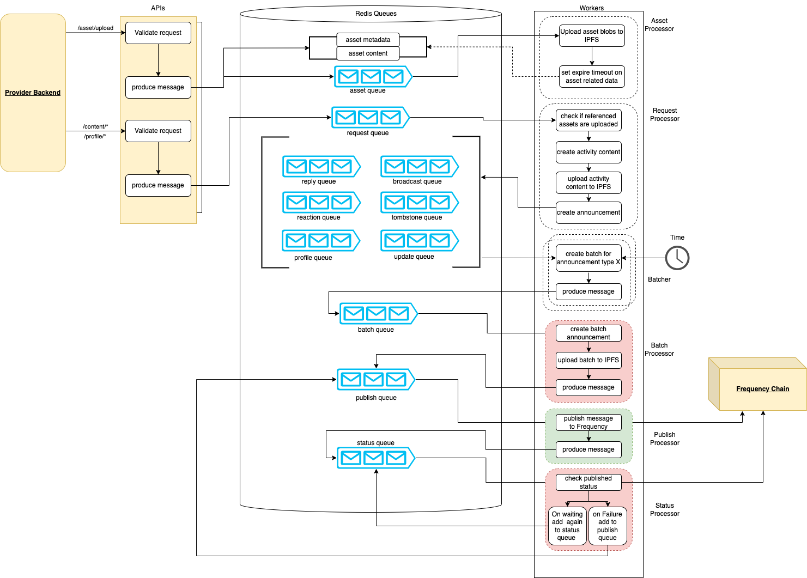

# Content Publisher

<!-- TABLE OF CONTENTS -->

# 📗 Table of Contents

- [📖 About the Project](#about-project)
- [🔍 Arch Map](#-arch-maps)
- [🛠 Built With](#-built-with)
  - [Tech Stack](#tech-stack)
  - [Key Features](#key-features)
- [🚀 Live OpenAPI Docs](#-live-docs)
- [💻 Getting Started](#-getting-started)
  - [Prerequisites](#prerequisites)
  - [Environment Variables](#environment-variables)
  - [Setup](#setup)
  - [Install](#install)
  - [Usage](#usage)
  - [Swagger](#swagger-ui)
  - [Queue Management](#queue-management)
  - [Run tests](#run-tests)
  - [Linting](#linting)
  - [Formatting](#auto-format)
- [🤝 Contributing](#-contributing)
- [⭐️ Show your support](#-support)
- [🙏 Acknowledgements](#-acknowledgements)
- [❓FAQ](#faq)
- [📝 License](#-license)

<!-- PROJECT DESCRIPTION -->

# 📖 Content Publishing Service <a name="about-project"></a>

The Content Publishing Service is part of the "Social Gateway" collection of services that provides a familiar REST API to allow uploading content and publishing announcements to the Frequency chain. The service handles all of the necessary blockchain interaction and allows clients to interact using a familiar, web2-friendly interface.

<!-- Arch maps -->

## 🔭 Arch Maps

The Content Publishing Service consists of two applications: an API controller, and one (or more) Worker processes. The API and Worker processes communicate via a shared BullMQ message queue. The API controller handles incoming requests and enqueues content publishing tasks for the Worker(s).



<p align="right">(<a href="#-table-of-contents">back to top</a>)</p>

## 🛠 Built With <a name="built-with"></a>

### Tech Stack <a name="tech-stack"></a>

<details>
  <summary>Server</summary>
  <ul>
    <li><a href="https://nestjs.com/">NestJS</a></li>
    <li><a href="https://nodejs.org/">Node.js</a></li>
    <li><a href="https://www.typescriptlang.org/">TypeScript</a></li>
  </ul>
</details>

<details>
  <summary>Data store</summary>
  <ul>
    <li><a href="https://redis.io/">Redis (ioredis)</a></li>
  </ul>
</details>

<details>
  <summary>Frameworks and Libraries</summary>
  <ul>
    <li><a href="https://docs.nestjs.com/techniques/queues">BullMQ (NestJS BullMQ Integration)</a></li>
    <li><a href="https://github.com/hapijs/joi">Joi</a></li>
    <li><a href="https://axios-http.com/">Axios</a></li>
  </ul>
</details>

<details>
  <summary>Polkadot and DSNP Integration</summary>
  <ul>
    <li><a href="https://polkadot.js.org/">Polkadot API (@polkadot/api)</a></li>
    <li><a href="https://github.com/LibertyDSNP/spec">DSNP (Activity Content, Frequency Schemas, ParquetJS)</a></li>
  </ul>
</details>

<details>
  <summary>Testing</summary>
  <ul>
    <li><a href="https://jestjs.io/">Jest</a>
        <ul>
          <li><a href="https://kulshekhar.github.io/ts-jest/">ts-jest</a></li>
          <li><a href="https://github.com/visionmedia/supertest">Supertest</a></li>
          <li><a href="https://github.com/stipsan/ioredis-mock">ioredis-mock</a></li>
        </ul>
      </li>
  </ul>
</details>

<details>
  <summary>Formatting</summary>
  <ul>
    <li><a href="https://prettier.io/">Prettier</a></li>
    <li><a href="https://typescript-eslint.io/">TypeScript ESLint</a></li>
  </ul>
</details>

<details>
  <summary>Build and Deployment</summary>
  <ul>
    <li><a href="https://github.com/motdotla/dotenv">Dotenv</a></li>
    <li><a href="https://www.docker.com/">Docker</a></li>
    <li><a href="https://docs.docker.com/compose/">Docker Compose</a></li>
    <li><a href="https://docs.nestjs.com/cli/overview">Nest CLI</a></li>
  </ul>
</details>

<!-- Features -->

### Key Features

#### API
- **Upload asset files**
- **Create a broadcast(post)**
- **Create a reply**
- **Create a reaction**
- **Update existing content**
- **Delete existing content (tombstones)**
- **Update a user profile**

#### Development API
- **Get the details of a job**
- **Get asset**
- **Populate a queue with dummy announcement data**

<p align="right">(<a href="#-table-of-contents">back to top</a>)</p>

<!-- LIVE Docs -->

## 🚀 Live Docs

- [Live Docs](https://amplicalabs.github.io/content-publishing-service/)
- [API Documentation](https://amplicalabs.github.io/content-publishing-service/)
- [GitHub](https://github.com/AmplicaLabs/content-publishing-service)

<p align="right">(<a href="#-table-of-contents">back to top</a>)</p>

<!-- GETTING STARTED -->

## 💻 Getting Started

This guide is tailored for developers working in the code base for the Content Publishing Service itself. For a more tutorial tailored more for developers wanting to deploy the Content Publishing Service as part of the broader Social Gateway in order to develop their own Social Gateway app, visit [Live Docs](https://amplicalabs.github.io/gateway/).

To prepare and run a local instance of the Content Publishing Service for local development, follow the guide below.

### Prerequisites

In order to run this project you need:

- [Nodejs](https://nodejs.org)
- [Docker](https://www.docker.com) or Docker-compatible container system for running Gateway Services
  - (note, Docker is not strictly required; all of the services described below may be installed or built & run locally, but that is outside the scope of this guide)

### Environment Variables

Use the provided [env.template](./env.template) file to create an initial environment for the application, and edit as desired. Additional documentation on the complete set of environment variables is provided in the [ENVIRONMENT.md](./ENVIRONMENT.md) file.

 1. For running the application under Docker, copy the environment template to `.env.docker.dev`; for running bare-metal, copy to `.env`.

  ```sh
  cp env.template .env 
  cp env.template .env.docker.dev
  ```

  2. Configure the environment variable values according to your environment.

### Setup

Clone this repository to your desired folder:

Example commands:

```sh
  git clone git@github.com:AmplicaLabs/content-publishing-service.git
  cd content-publishing-service
```

### Install

Install NPM Dependencies:

```sh
  npm install
```

### Usage

To run the project, execute the following command:

#### 1. Start the required auxiliary services

  Frequency node, Redis, IPFS

  ```sh
  docker compose up -d frequency redis ipfs
  ```

#### 2. Start the application services

  Each of the application services may be run either under Docker or bare-metal, depending on your preferred development workflow. 
  
  The instructions are the same for running both the API service and the worker service:
    
  - **Substitute "api" or "worker" for the "< service >" tag in the commands below.**

  #### Running bare metal
  ```sh
  npm run start:<service>::dev
  ```

  -- or --
  
  #### Running under Docker
  ```sh
  docker compose up [-d] content-publishing-service-<service>
  ```

#### 3. Check the job in BullUI, to monitor job progress based on defined tests.

### Swagger UI
Check out the Swagger UI hosted on the app instance at http://localhost:3000/api/docs/swagger to view the API documentation and submit requests to the service.

### Queue Management
You may also view and manage the application's queue at http://localhost:3000/queues.

### Run tests

To run tests, run the following command:

```sh
  npm test
```

### Linting:

```sh
  npm run lint
```

### Auto-format:

```sh
  npm run format
```

<p align="right">(<a href="#-table-of-contents">back to top</a>)</p>

<!-- CONTRIBUTING -->

## 🤝 Contributing

Contributions, issues, and feature requests are welcome!

- [Contributing Guidelines](./CONTRIBUTING.md)
- [Open Issues](https://github.com/AmplicaLabs/content-publishing-service/issues)

<p align="right">(<a href="#-table-of-contents">back to top</a>)</p>

<!-- SUPPORT -->

## ⭐️ Show your support

If you would like to explore contributing bug fixes or enhancements, issues with the label `good-first-issue` can be a good place to start.

<p align="right">(<a href="#-table-of-contents">back to top</a>)</p>

<!-- ACKNOWLEDGEMENTS -->

## 🙏 Acknowledgements

Thank you to [Frequency](https://www.frequency.xyz) for assistance and documentation making this possible.

<!-- FAQ (optional) -->

## ❓FAQ

- **Can I use this service in my production social app?**

  - Yes. All the Gateway Services are intended to be ready-to-use out of the box as part of the fabric of your own social media app using DSNP on Frequency.

<p align="right">(<a href="#-table-of-contents">back to top</a>)</p>

<!-- LICENSE -->

## 📝 License

This project is [Apache 2.0](./LICENSE) licensed.

<p align="right">(<a href="#-table-of-contents">back to top</a>)</p>